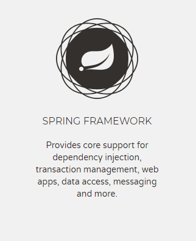
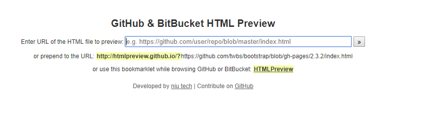

# spring-framework-5-reference

Chinese verion of Spring Framework 5 Reference Documentation (https://docs.spring.io/spring/docs/current/spring-framework-reference/).

《Spring Framework 5.x参考文档》中文翻译。截止目前，Spring Framework 的最新版本为 5.0.2.RELEASE。

### 意见、建议、勘误 

如有勘误、意见或建议欢迎拍砖 https://github.com/zekaryu/spring-framework-5-reference/issues

### 联系作者：
 
 * Gmail: [zekaryu@gmail.com](mailto:zekaryu@gmail.com)
 * Twitter: [@ZekarYu](https://twitter.com/zekaryu)
 * Github: [zekaryu](https://github.com/zekaryu)

#### 编写参考

https://github.com/waylau/spring-framework-4-reference

### 关于html网而言太大，github打不开：

您可以直接将github上html文件的url链接复制到 [html预览入口](http://htmlpreview.github.com/)的输入框中，如下

